# MaLife Lake 기능 가이드

> 금융/보험 도메인 Secure Agentic RAG 플랫폼

---

## 목차

1. [대시보드](#1-대시보드)
2. [볼트 탐색기](#2-볼트-탐색기)
3. [에이전트 콘솔](#3-에이전트-콘솔)
4. [문서 업로드](#4-문서-업로드)
5. [시맨틱 검색](#5-시맨틱-검색)
6. [지식 그래프](#6-지식-그래프)
7. [스킬 관리](#7-스킬-관리)
8. [관리 패널](#8-관리-패널)

---

## 1. 대시보드

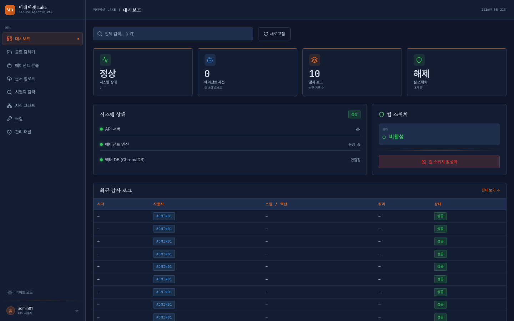

시스템 전체 현황을 한 눈에 파악합니다.
- Vault 문서 수, 그래프 노드/엣지 수, 최근 활동
- 킬 스위치 상태, 서비스 헬스 체크

---

## 2. 볼트 탐색기

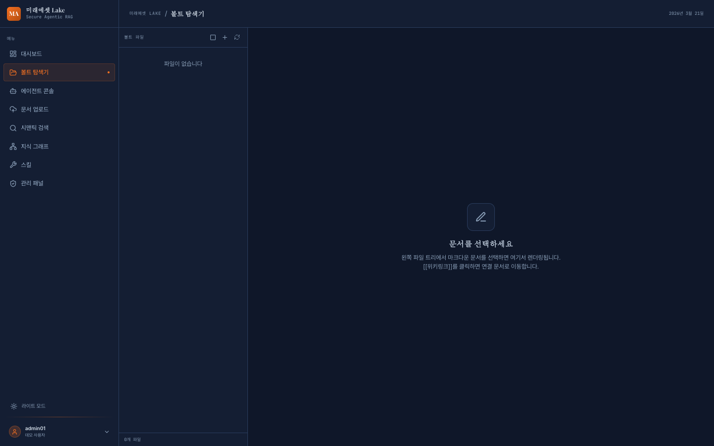

Git 기반 마크다운 문서를 탐색합니다.
- 폴더 트리 탐색 (Public / Private)
- 마크다운 뷰어 (표, 코드 블록, [[위키링크]] 지원)
- YAML frontmatter 메타데이터 표시
- Skills, .graph 등 시스템 폴더는 자동 숨김

---

## 3. 에이전트 콘솔

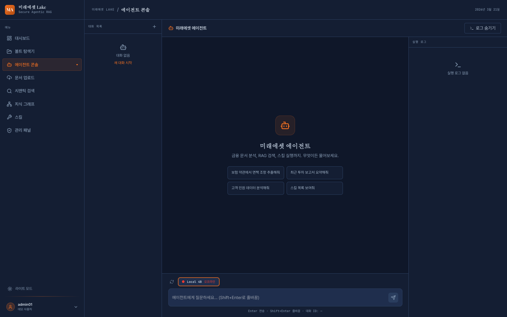

AI 에이전트에 질문하고 답변을 받습니다.

### 3.1 모델 선택 + 서버 부하

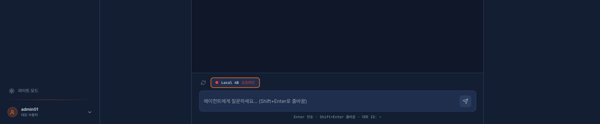

- 입력창 위에 GPU 서버 선택 버튼 표시
- 각 서버의 부하 상태를 신호등 색으로 표시
  - 초록: 원활 (0~40%)
  - 주황: 보통 (40~75%)
  - 빨강: 혼잡 (75%+) 또는 오프라인
- ↻ 버튼으로 실시간 상태 새로고침
- 관리자가 추가한 GPU 서버가 자동으로 나타남

### 3.2 스트리밍 응답

- 토큰 단위 실시간 스트리밍
- GraphRAG 컨텍스트 자동 주입
- 사용자 소속(부서)에 맞는 사규/매뉴얼 우선 참조

### 3.3 인라인 출처 인용

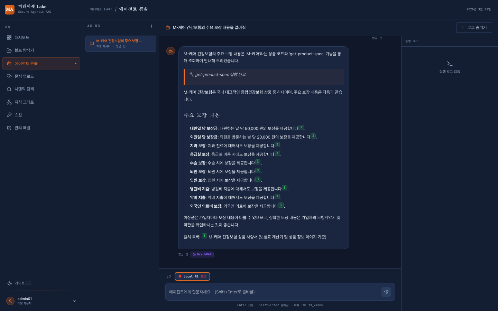

- 답변 내 `[1]`, `[2]` 형태의 인라인 인용
- 색상 코딩된 번호 배지 (출처 노드와 동일 색상)
- 답변 하단에 출처 목록: 엔티티명 + 소스 문서 + 페이지 + 시행일

### 3.4 그래프 오버레이

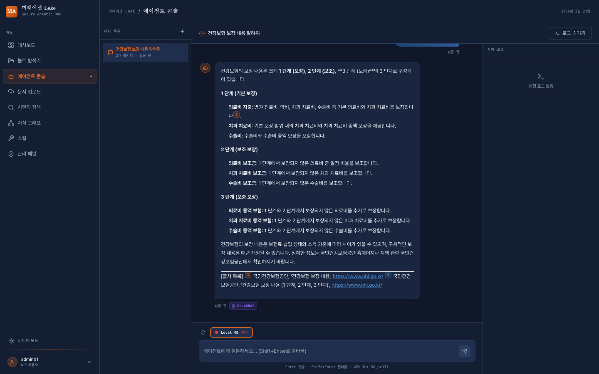

- GraphRAG 배지 또는 개별 출처 배지 클릭
- 참조된 엔티티의 서브그래프를 오버레이로 표시
- 출처 노드는 번호 + 색상으로 하이라이트
- 줌/패닝, 전체화면 지원

### 3.5 실행 로그

- 우측 사이드바에 스킬 실행 로그
- 각 스텝의 입력/출력, 소요 시간, 상태

---

## 4. 문서 업로드

### 4.1 파일 업로드
- 드래그 앤 드롭 또는 파일 선택
- 지원 포맷: PDF, HWP, PPTX, DOCX, TXT, MD
- 최대 50MB

### 4.2 폴더 업로드
- 폴더 전체를 하위 구조 유지하며 일괄 업로드

### 4.3 로컬 경로 인제스트
- 서버의 로컬 디렉토리를 직접 변환
- 백그라운드 태스크로 실행 (페이지 이동해도 계속)
- 변환 중지 버튼으로 언제든 취소 가능

### 4.4 PDF → DOCX → 그래프 적재
- POST `/api/v1/ingest/pdf-to-docx`
- pdf2docx로 레이아웃 보존 DOCX 변환
- 마크다운 인제스션 + 지식그래프 엔티티 추출
- 스캔 PDF는 자동 OCR (tesseract 한국어)

### 4.5 백그라운드 태스크바

- 화면 우하단에 고정 (모든 페이지에서 표시)
- 진행 중인 변환/인제스트 태스크 진행률 표시
- 취소(X) 버튼으로 태스크 중지
- 완료/실패 태스크 최근 3건 표시

---

## 5. 시맨틱 검색

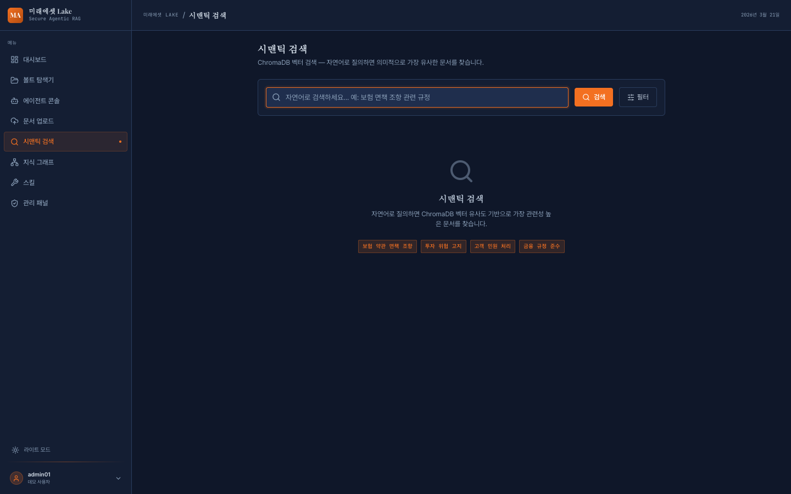

- ChromaDB 벡터 검색
- ACL 기반 필터링 (사용자 역할에 따라 접근 가능한 문서만)
- 멀티소스 RAG 검색 (GraphRAG + 벡터 결합)

---

## 6. 지식 그래프

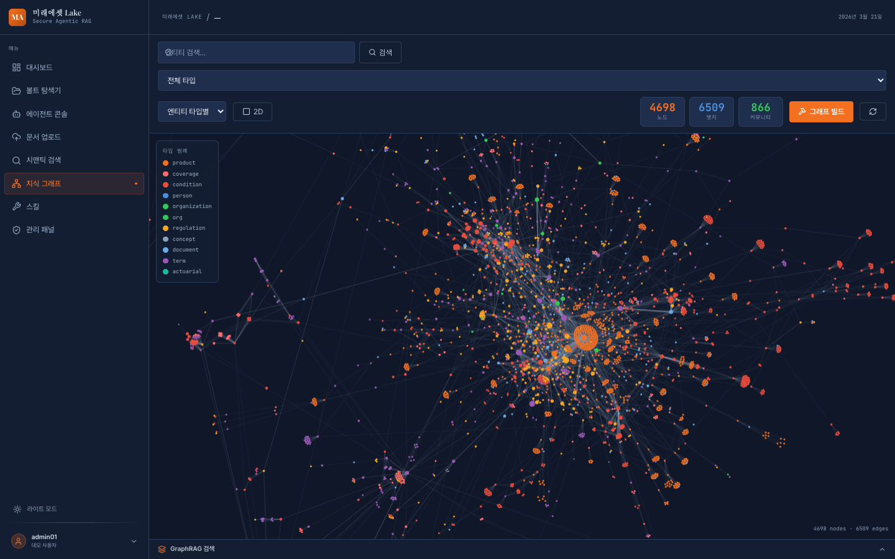

- 2D/3D 인터랙티브 그래프 시각화
- 엔티티 검색 + 타입 필터
- 커뮤니티 탐지 및 요약
- 서브그래프 탐색 (깊이 1~4)
- 그래프 통계 (노드/엣지/타입 분포)

---

## 7. 스킬 관리

### 7.1 스킬 관리 탭
- 설치된 스킬 목록, 삭제
- 카테고리별 색상 태그 (검색/분석/리포트/커스텀)

### 7.2 스킬 만들기 탭
- 폼으로 커스텀 스킬 생성
- 이름, 설명, 엔드포인트, 메서드, 파라미터(JSON), 카테고리

### 7.3 마켓플레이스 탭

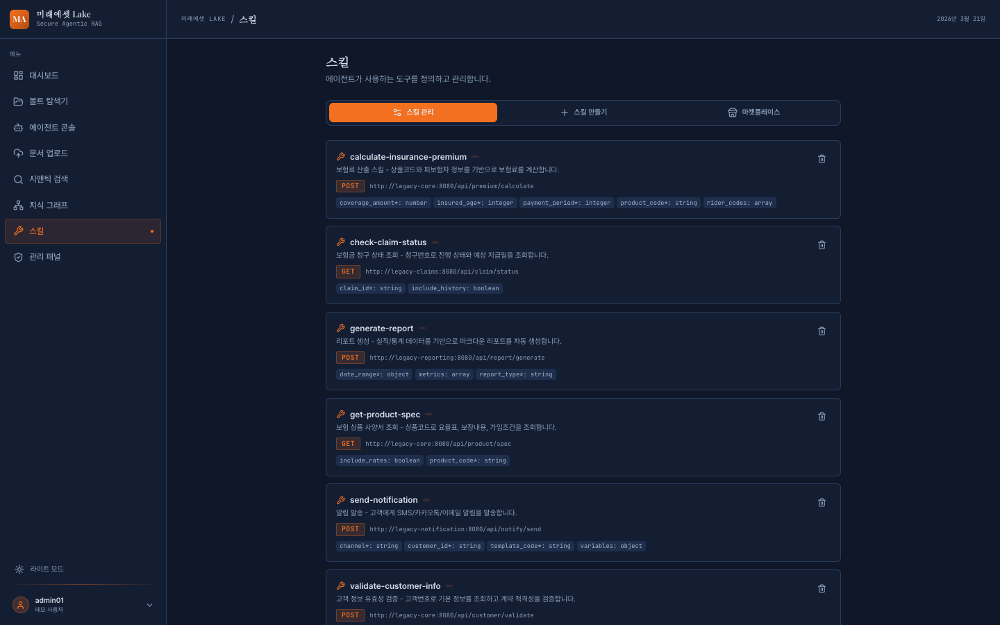

사전 정의 스킬을 한 클릭으로 설치:
- **멀티소스 RAG 검색**: GraphRAG + 벡터 결합, 인라인 인용 지원
- **GraphRAG 검색**: 지식그래프 기반 엔티티 검색
- **Vault 검색/읽기**: ChromaDB 벡터 검색, 문서 직접 조회
- **보험료 계산기**: 레거시 시스템 연동
- **문서 요약**: 에이전트 재귀 호출

---

## 8. 관리 패널

> 관리자(admin) 역할만 접근 가능

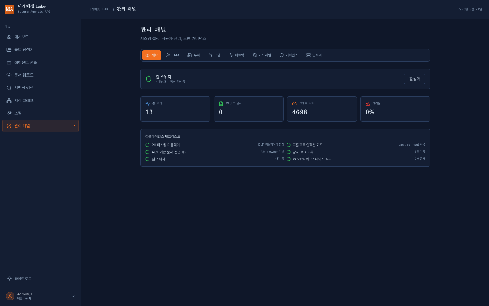

### 8.1 개요
- 킬 스위치 토글
- 주요 지표 (총 쿼리, Vault 문서, 그래프 노드, 에러율)
- 컴플라이언스 체크리스트 요약

### 8.2 IAM (사용자 + 세분화된 권한)

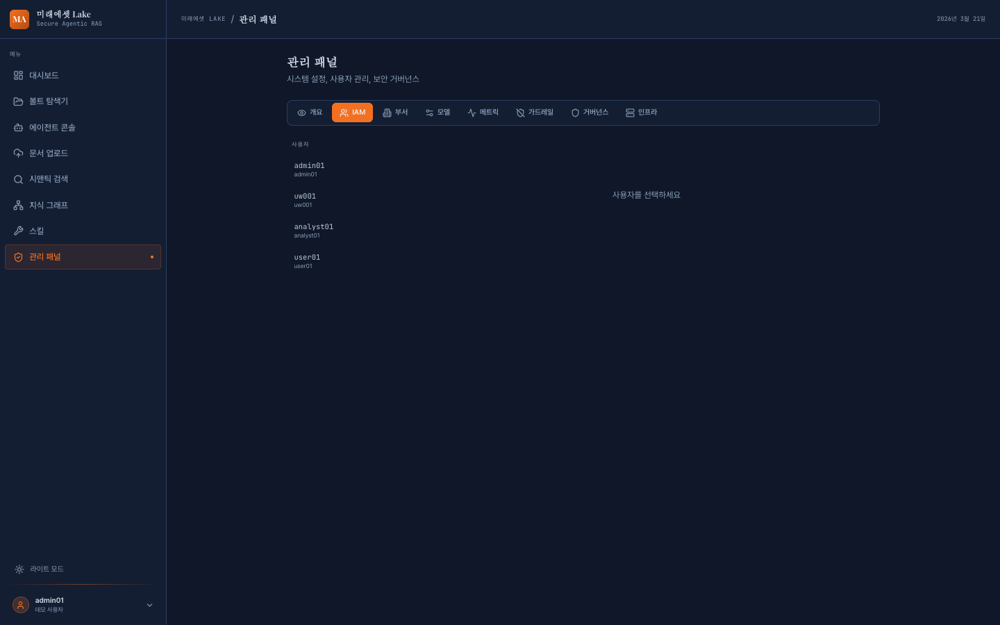

- 22개 세분화된 권한 (문서/에이전트/검색/그래프/관리)
- 사용자 선택 → 체크박스로 개별 권한 토글
- 역할 템플릿 한 클릭 적용 (관리자/매니저/분석가/조회자)
- 소속(부서) 지정 → 소속별 사규/매뉴얼 자동 필터링

### 8.3 부서 관리

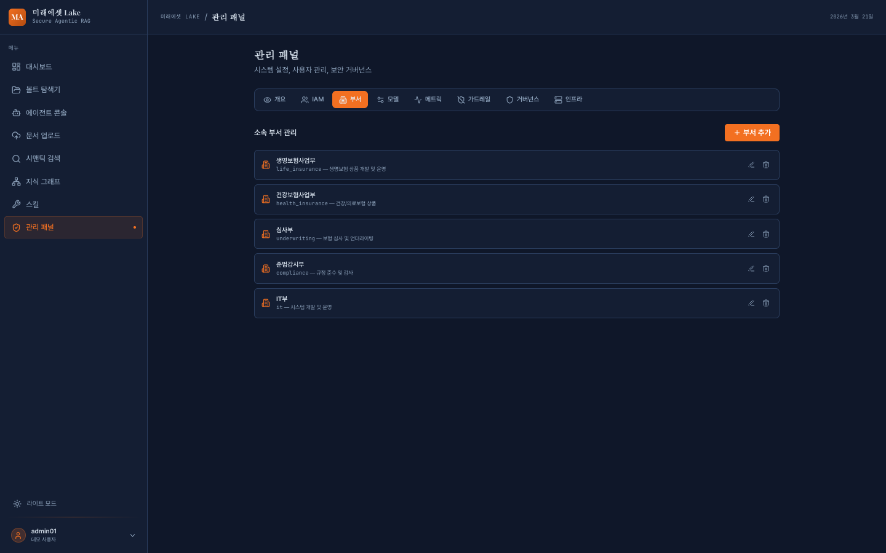

- **부서 목록** — 등록된 부서 (ID, 이름, 설명) 표시
- **부서 추가** — ID, 부서명, 설명 입력 → 추가 버튼
- **부서 수정** — 편집 버튼 → 인라인 수정
- **부서 삭제** — 삭제 버튼
- 사용자의 소속 부서에 따라 에이전트가 관련 사규/매뉴얼을 우선 참조
- IAM 탭에서 사용자별 소속 부서 지정 가능

### 8.4 모델 설정

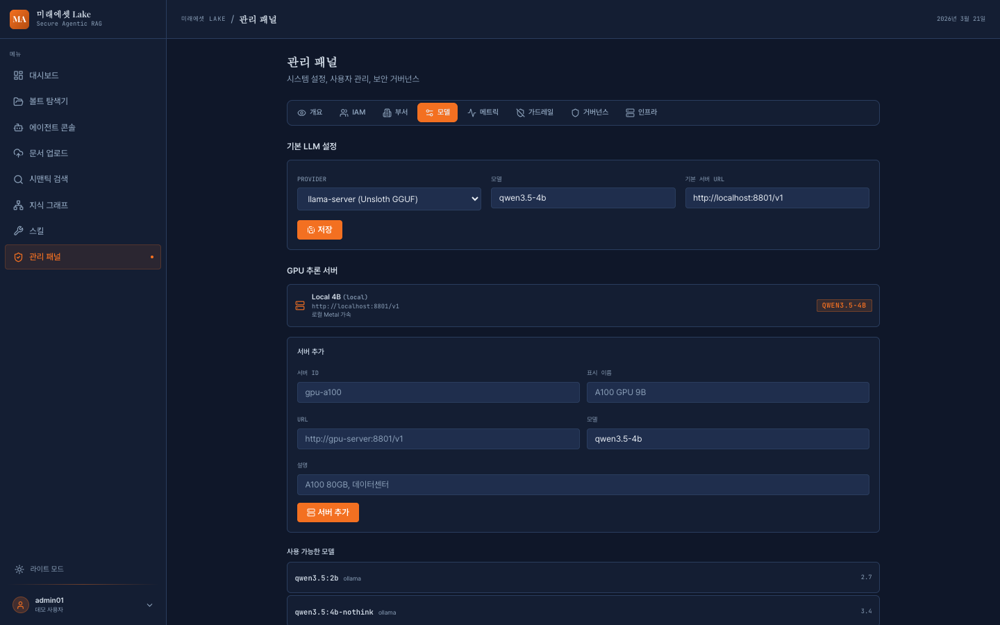

- LLM Provider/Model 변경 (llama-server, Ollama, Claude, OpenAI)
- **GPU 서버 관리**: 추가/삭제 (ID, 이름, URL, 모델, 설명)
  - 추가한 서버는 에이전트 콘솔에 자동 반영
  - SSRF 방지: 등록된 서버 URL만 허용

### 8.5 메트릭

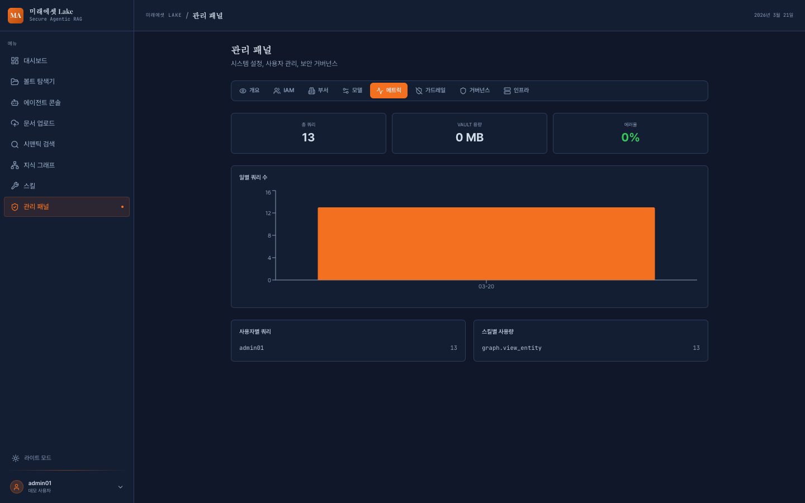

- 일별 쿼리 수 차트
- 사용자별/스킬별 사용량
- Vault 용량, 에러율

### 8.6 거버넌스 (컴플라이언스)

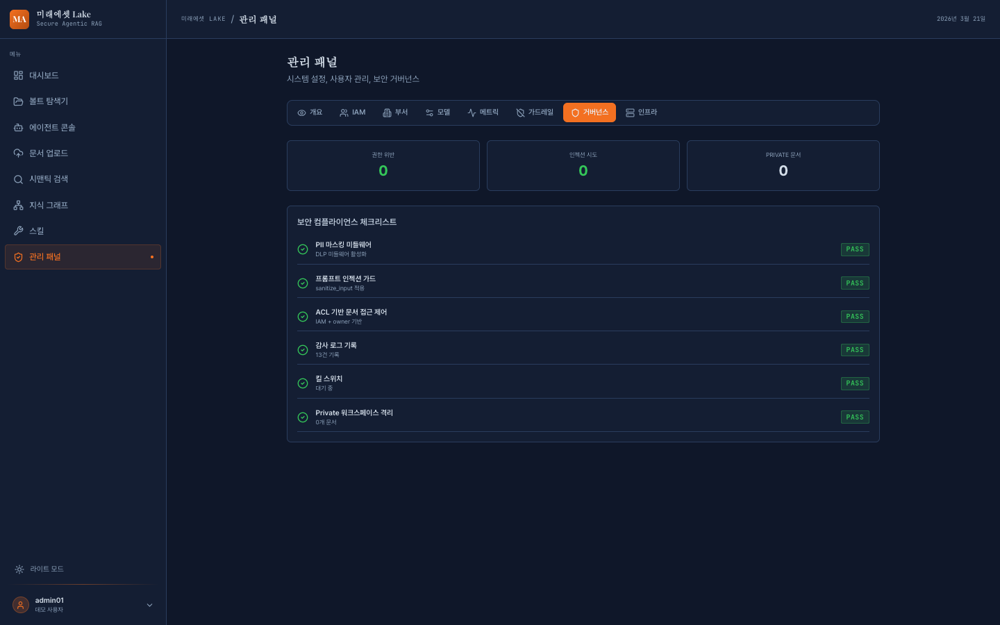

- 보안 체크리스트 (PII 마스킹, 프롬프트 인젝션 가드, ACL, 감사로그, 킬스위치, Private 격리)
- 권한 위반 횟수, 인젝션 시도 횟수
- 최근 위반 내역

### 8.7 인프라

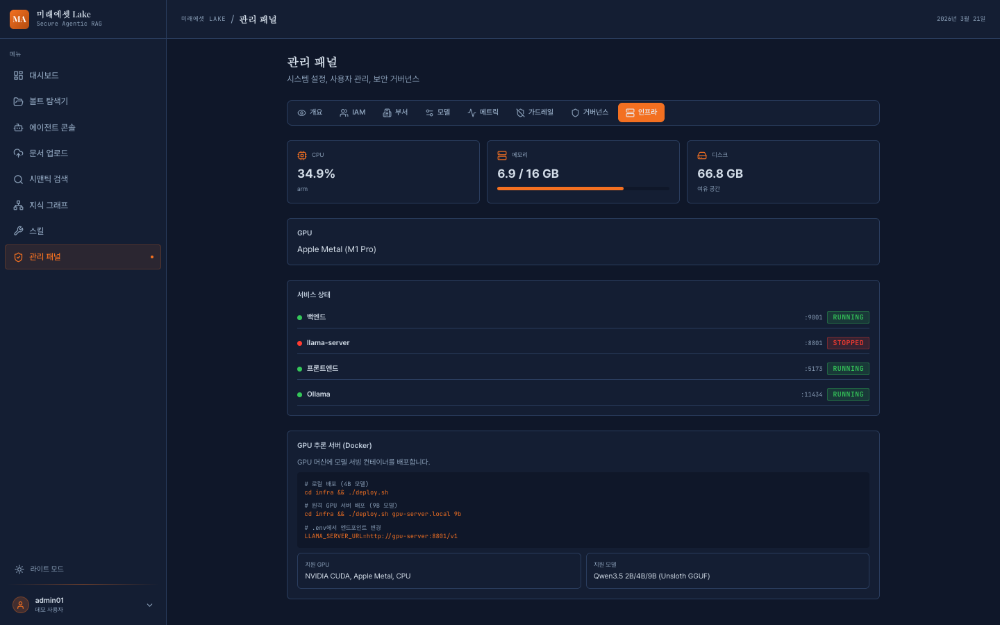

- CPU/메모리/디스크 사용량
- GPU 정보 (Apple Metal)
- 서비스 상태 (백엔드, llama-server, 프론트엔드, Ollama)
- GPU 추론 서버 Docker 배포 가이드

---

## 다크/라이트 모드

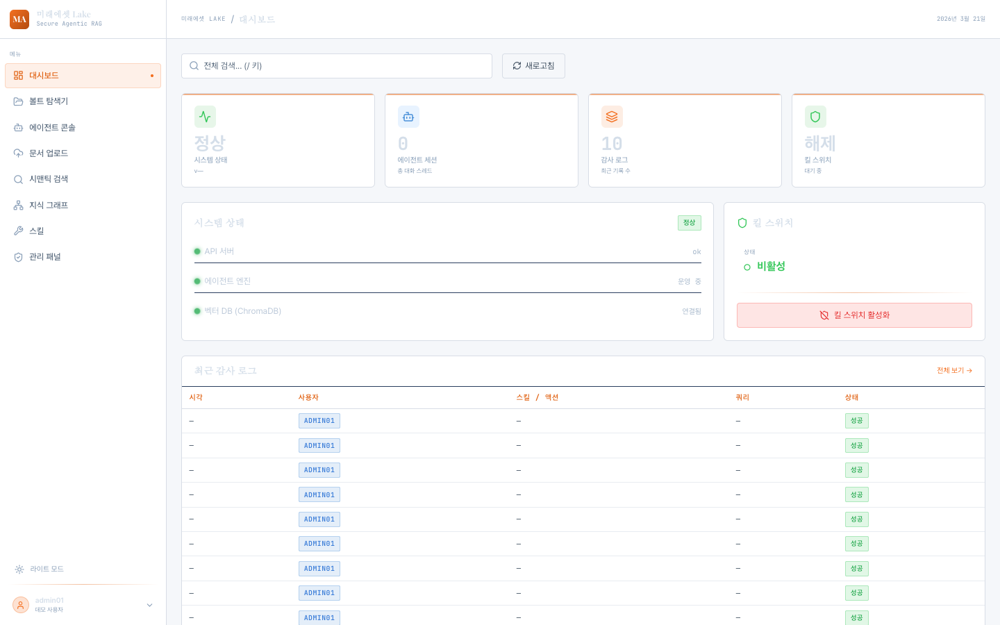

- 사이드바 하단 토글 버튼 (Sun/Moon)
- localStorage에 저장, 새로고침 유지

---

## 문서 버전 관리

- frontmatter `effective_date` 또는 파일명 날짜(`_약관_20220101.md`)에서 시행일 자동 추출
- 지식그래프 엔티티에 `effective_date` 속성 저장
- 같은 약관이라도 시행일별로 다른 버전으로 관리
- 에이전트 답변 시 시행일 명시

---

## API 요약

| 엔드포인트 | 메서드 | 설명 |
|------------|--------|------|
| `/api/v1/vault/list` | GET | 문서 목록 |
| `/api/v1/vault/read` | GET | 문서 읽기 |
| `/api/v1/ingest/upload` | POST | 파일 업로드 (백그라운드) |
| `/api/v1/ingest/pdf-to-docx` | POST | PDF→DOCX→그래프 (백그라운드) |
| `/api/v1/ingest/ingest-local` | POST | 로컬 경로 인제스트 (백그라운드) |
| `/api/v1/ingest/tasks` | GET | 태스크 목록 |
| `/api/v1/ingest/tasks/{id}` | DELETE | 태스크 취소 |
| `/api/v1/search/` | GET | 벡터 검색 |
| `/api/v1/search/multi-source` | POST | 멀티소스 RAG 검색 |
| `/api/v1/agent/stream` | POST | 에이전트 SSE 스트리밍 |
| `/api/v1/agent/run` | POST | 에이전트 백그라운드 실행 |
| `/api/v1/graph/search` | POST | GraphRAG 검색 |
| `/api/v1/graph/visualization` | GET | 전체 그래프 시각화 |
| `/api/v1/graph/entity/{id}/subgraph` | GET | 엔티티 서브그래프 |
| `/api/v1/skills/list` | GET | 스킬 목록 |
| `/api/v1/skills/create` | POST | 스킬 생성 |
| `/api/v1/skills/marketplace` | GET | 마켓플레이스 |
| `/api/v1/skills/marketplace/install/{name}` | POST | 스킬 설치 |
| `/api/v1/admin/iam` | GET/PUT | IAM 관리 |
| `/api/v1/admin/permissions/*` | GET/PUT/POST | 세분화된 권한 |
| `/api/v1/admin/model-config` | GET/PUT | 모델 설정 |
| `/api/v1/admin/gpu-servers` | GET/POST/DELETE | GPU 서버 관리 |
| `/api/v1/admin/inference-status` | GET | 추론 서버 부하 |
| `/api/v1/admin/metrics` | GET | 사용량 메트릭 |
| `/api/v1/admin/governance` | GET | 거버넌스 보고서 |
| `/api/v1/admin/infra` | GET | 인프라 상태 |
